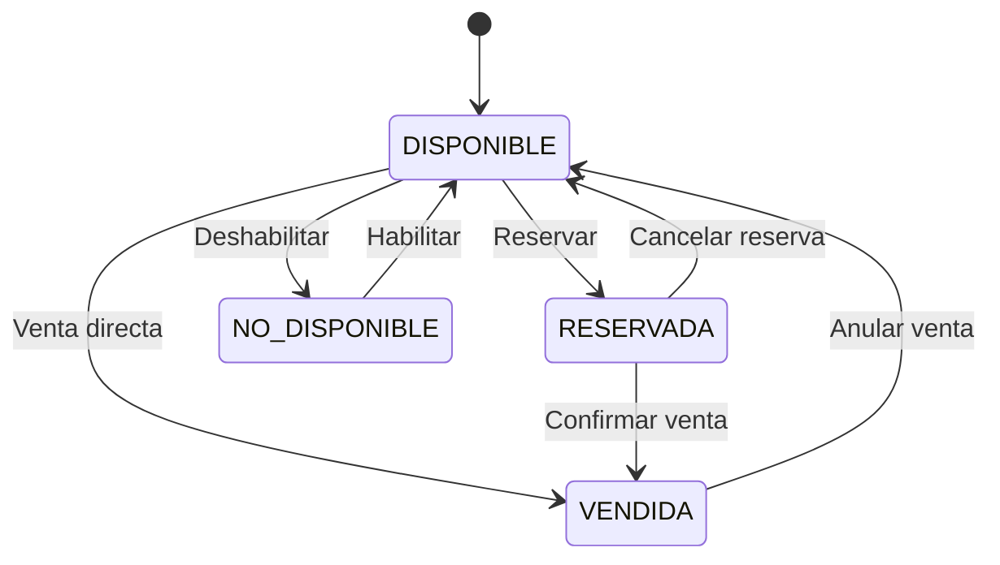
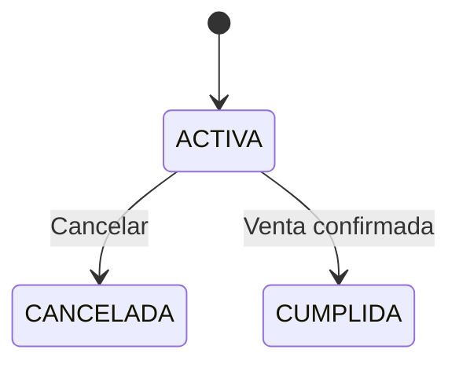
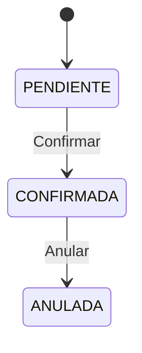
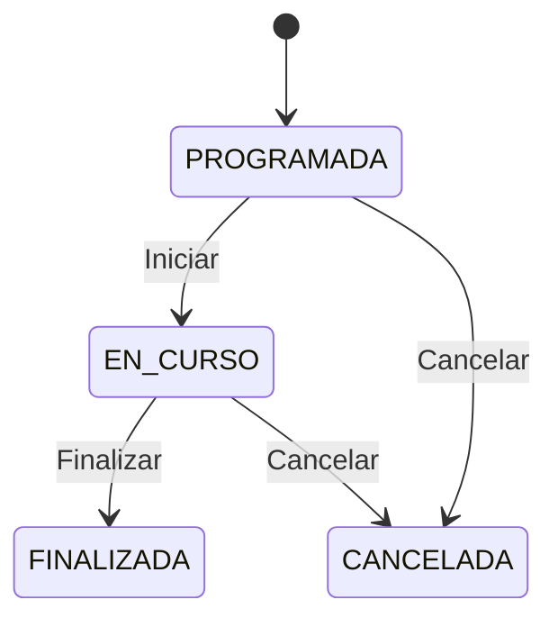
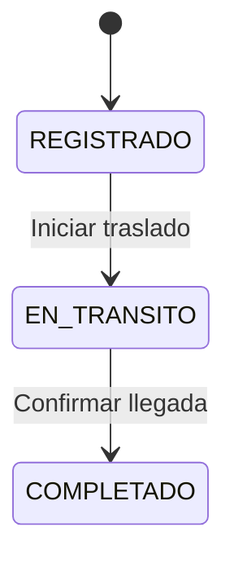
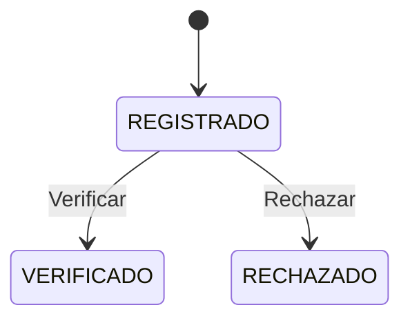

# HU-02 — Historias de Estado (20)

## EST-001 — Estado de obra
- **ID:** EST-001
- **Entidad/proceso:** Obra (artwork)
- **Estado inicial:** DISPONIBLE (al crear)
- **Estados posibles:** DISPONIBLE, RESERVADA, VENDIDA, NO_DISPONIBLE
- **Eventos de transición:**
  - RESERVAR → DISPONIBLE → RESERVADA
  - CONFIRMAR_VENTA → RESERVADA → VENDIDA
  - CONFIRMAR_VENTA → DISPONIBLE → VENDIDA
  - CANCELAR_RESERVA → RESERVADA → DISPONIBLE
  - ANULAR_VENTA → VENDIDA → DISPONIBLE
  - DESHABILITAR → * → NO_DISPONIBLE
  - HABILITAR → NO_DISPONIBLE → DISPONIBLE
- **Reglas de transición:**
  - Solo DISPONIBLE puede reservarse.
  - Solo DISPONIBLE o RESERVADA puede venderse.
  - Solo RESERVADA puede cancelarse.
  - Solo VENDIDA puede anularse.
  - NO_DISPONIBLE puede volver a DISPONIBLE.
- **Estados finales:** Ninguno (todos son transitorios salvo eliminación lógica).
- **Restricciones:** No se permite saltar estados intermedios.
- **Requerimientos:** REQ-023, REQ-024, EST-001

## EST-002 — Estado de reserva
- **ID:** EST-002
- **Entidad/proceso:** Reserva (reservation)
- **Estado inicial:** ACTIVA (al crear)
- **Estados posibles:** ACTIVA, CANCELADA, CUMPLIDA
- **Eventos de transición:**
  - CANCELAR → ACTIVA → CANCELADA
  - CUMPLIR → ACTIVA → CUMPLIDA (cuando se confirma venta asociada)
- **Reglas:**
  - Solo reservas ACTIVAS bloquean ventas.
  - Reserva CANCELADA libera la obra.
  - Reserva CUMPLIDA se da cuando la venta se confirma.
- **Requerimientos:** REQ-015, REQ-016, REQ-053

## EST-003 — Estado de venta
- **ID:** EST-003
- **Entidad/proceso:** Venta (sale)
- **Estado inicial:** PENDIENTE (al crear)
- **Estados posibles:** PENDIENTE, CONFIRMADA, ANULADA
- **Eventos de transición:**
  - CONFIRMAR → PENDIENTE → CONFIRMADA
  - ANULAR → CONFIRMADA → ANULADA
- **Reglas:**
  - Solo ventas CONFIRMADAS pueden anularse.
  - PENDIENTE puede cancelarse eliminando el registro.
  - ANULADA es estado terminal para la venta.
- **Requerimientos:** REQ-020, REQ-021

## EST-004 — Estado de exposición
- **ID:** EST-004
- **Entidad/proceso:** Exposición (exhibition)
- **Estado inicial:** PROGRAMADA (al crear)
- **Estados posibles:** PROGRAMADA, EN_CURSO, FINALIZADA, CANCELADA
- **Eventos de transición:**
  - INICIAR → PROGRAMADA → EN_CURSO (cuando start_date llega)
  - FINALIZAR → EN_CURSO → FINALIZADA (cuando end_date llega)
  - CANCELAR → PROGRAMADA/EN_CURSO → CANCELADA
- **Reglas:**
  - La transición PROGRAMADA → EN_CURSO puede ser automática o manual.
  - FINALIZADA es estado terminal.
  - Obras asignadas se liberan al finalizar.
- **Requerimientos:** REQ-013, REQ-031

## EST-005 — Estado de movimiento
- **ID:** EST-005
- **Entidad/proceso:** Movimiento (movement)
- **Estado inicial:** REGISTRADO (al crear)
- **Estados posibles:** REGISTRADO, EN_TRANSITO, COMPLETADO
- **Eventos de transición:**
  - INICIAR → REGISTRADO → EN_TRANSITO
  - COMPLETAR → EN_TRANSITO → COMPLETADO
- **Reglas:**
  - El estado se actualiza al confirmar llegada.
- **Requerimientos:** REQ-011

## EST-006 — Estado de pago
- **ID:** EST-006
- **Entidad/proceso:** Pago (payment)
- **Estado inicial:** REGISTRADO (al crear)
- **Estados posibles:** REGISTRADO, VERIFICADO, RECHAZADO
- **Eventos de transición:**
  - VERIFICAR → REGISTRADO → VERIFICADO
  - RECHAZAR → REGISTRADO → RECHAZADO
- **Reglas:**
  - Verificación confirma que el pago fue procesado.
- **Requerimientos:** REQ-022

## EST-007 — Estado de artista
- **ID:** EST-007
- **Entidad/proceso:** Artista (artist) — de HU-01
- **Estado inicial:** ACTIVO (al crear)
- **Estados posibles:** ACTIVO, INACTIVO
- **Eventos de transición:**
  - DESHABILITAR → ACTIVO → INACTIVO
  - HABILITAR → INACTIVO → ACTIVO
- **Reglas:**
  - Artista INACTIVO no puede asociarse a nuevas obras.
  - Obras existentes mantienen la asociación.
- **Requerimientos:** HU-01 (respetado)

## EST-008 — Estado de cliente
- **ID:** EST-008
- **Entidad/proceso:** Cliente (customer)
- **Estado inicial:** ACTIVO (al crear)
- **Estados posibles:** ACTIVO, INACTIVO
- **Eventos de transición:**
  - DESHABILITAR → ACTIVO → INACTIVO
  - HABILITAR → INACTIVO → ACTIVO
- **Reglas:**
  - Cliente INACTIVO no puede participar en nuevas ventas.
  - Ventas existentes se mantienen.
- **Requerimientos:** REQ-017

## EST-009 — Estado de ubicación
- **ID:** EST-009
- **Entidad/proceso:** Ubicación (location)
- **Estado inicial:** ACTIVA (al crear)
- **Estados posibles:** ACTIVA, INACTIVA
- **Eventos de transición:**
  - DESHABILITAR → ACTIVA → INACTIVA
  - HABILITAR → INACTIVA → ACTIVA
- **Reglas:**
  - Ubicación INACTIVA no recibe nuevos movimientos.
- **Requerimientos:** REQ-009

## EST-010 — Estado de autoría
- **ID:** EST-010
- **Entidad/proceso:** Autoría (artwork_artist)
- **Estado inicial:** ACTIVA (al crear)
- **Estados posibles:** ACTIVA, REVOCADA
- **Eventos de transición:**
  - REVOCAR → ACTIVA → REVOCADA
- **Reglas:**
  - Autoría REVOCADA mantiene el historial.
  - No se elimina físicamente.
- **Requerimientos:** REQ-006

## EST-011 — Estado de象tra de obra (historial)
- **ID:** EST-011
- **Entidad/proceso:** Historial de estados (artwork_status_history)
- **Estado inicial:** REGISTRADO (al crear)
- **Estados posibles:** REGISTRADO (inmutable)
- **Eventos de transición:** Ninguno (append-only)
- **Reglas:**
  - Los registros de historial no se modifican ni eliminan.
- **Requerimientos:** REQ-042

## EST-012 — Estado de象tra de movimiento (historial)
- **ID:** EST-012
- **Entidad/proceso:** Historial de movimientos (movements)
- **Estado inicial:** REGISTRADO (al crear)
- **Estados posibles:** REGISTRADO (inmutable)
- **Eventos de transición:** Ninguno (append-only)
- **Reglas:**
  - Los movimientos no se eliminan.
- **Requerimientos:** REQ-012

## EST-013 — Estado de象tra de venta (auditoría)
- **ID:** EST-013
- **Entidad/proceso:** Auditoría de ventas (sale_audits)
- **Estado inicial:** REGISTRADO (al crear)
- **Estados posibles:** REGISTRADO (inmutable)
- **Eventos de transición:** Ninguno (append-only)
- **Reglas:**
  - Todo cambio de estado de venta genera registro.
- **Requerimientos:** REQ-035

## EST-014 — Estado de象tra de reserva (historial)
- **ID:** EST-014
- **Entidad/proceso:** Historial de reservas (reservation_history)
- **Estado inicial:** REGISTRADO
- **Estados posibles:** REGISTRADO (inmutable)
- **Reglas:** Append-only.
- **Requerimientos:** REQ-015, REQ-016

## EST-015 — Estado de象tra de pago (historial)
- **ID:** EST-015
- **Entidad/proceso:** Historial de pagos (payment_history)
- **Estado inicial:** REGISTRADO
- **Estados posibles:** REGISTRADO (inmutable)
- **Reglas:** Append-only.
- **Requerimientos:** REQ-022

## EST-016 — Estado de象tra de exposición (historial)
- **ID:** EST-016
- **Entidad/proceso:** Historial de exposiciones (exhibition_history)
- **Estado inicial:** REGISTRADO
- **Estados posibles:** REGISTRADO (inmutable)
- **Reglas:** Append-only.
- **Requerimientos:** REQ-013

## EST-017 — Estado de象tra de cliente (historial)
- **ID:** EST-017
- **Entidad/proceso:** Historial de clientes (customer_history)
- **Estado inicial:** REGISTRADO
- **Estados posibles:** REGISTRADO (inmutable)
- **Reglas:** Append-only.
- **Requerimientos:** REQ-017

## EST-018 — Estado de象tra de ubicación (historial)
- **ID:** EST-018
- **Entidad/proceso:** Historial de ubicaciones (location_history)
- **Estado inicial:** REGISTRADO
- **Estados posibles:** REGISTRADO (inmutable)
- **Reglas:** Append-only.
- **Requerimientos:** REQ-009

## EST-019 — Estado de象tra de artista (historial)
- **ID:** EST-019
- **Entidad/proceso:** Historial de artistas (artist_history) — extensión de HU-01
- **Estado inicial:** REGISTRADO
- **Estados posibles:** REGISTRADO (inmutable)
- **Reglas:** Append-only.
- **Requerimientos:** HU-01

## EST-020 — Estado de象tra de autoría (historial)
- **ID:** EST-020
- **Entidad/proceso:** Historial de autorías (artwork_artist_history)
- **Estado inicial:** REGISTRADO
- **Estados posibles:** REGISTRADO (inmutable)
- **Reglas:** Append-only.
- **Requerimientos:** REQ-006
