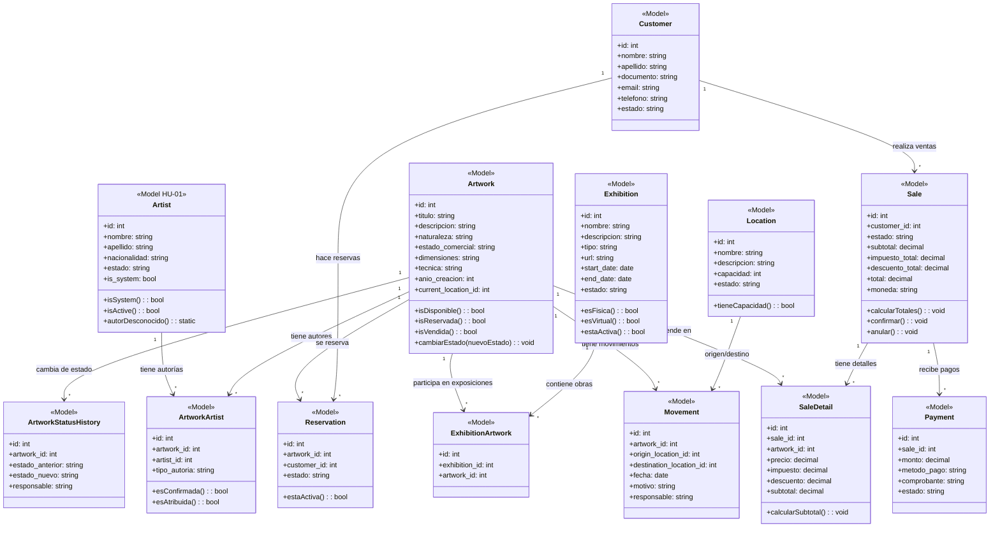

# HU-02 — Diseño de Clases

## Diagrama de Clases (Mermaid)

## Models (Entidades de dominio)

### Artist (HU-01 — no modificar)
- **Responsabilidad:** Representar un artista del museo.
- **No se modifica.**

### Artwork
- **Responsabilidad:** Representar una obra de arte con todos sus atributos.
- **Atributos:** titulo, descripcion, naturaleza, estado_comercial, dimensiones, tecnica, anio_creacion, current_location_id, deleted_at.
- **Métodos:** isDisponible(), isReservada(), isVendida(), cambiarEstado().
- **Relaciones:** artists (N:M via artwork_artists), location (1:N), movements (1:N), exhibitions (N:M via exhibition_artwork), sales (N:M via sale_details), reservations (1:N), statusHistory (1:N).
- **Reglas:** Estado comercial sigue máquina de estados. Soft delete.

### ArtworkArtist
- **Responsabilidad:** Modelar la relación entre obra y artista con tipo de autoría.
- **Atributos:** artwork_id, artist_id, tipo_autoria.
- **Reglas:** tipo_autoria es 'confirmada' o 'atribuida'.

### Location
- **Responsabilidad:** Representar una ubicación física del museo.
- **Atributos:** nombre, descripcion, capacidad, estado.
- **Métodos:** tieneCapacidad().

### Movement
- **Responsabilidad:** Registrar el traslado de una obra entre ubicaciones.
- **Atributos:** artwork_id, origin_location_id, destination_location_id, fecha, motivo, responsable.

### Exhibition
- **Responsabilidad:** Representar una exposición (física o virtual).
- **Atributos:** nombre, descripcion, tipo, url, start_date, end_date, estado.
- **Métodos:** esFisica(), esVirtual(), estaActiva().

### ExhibitionArtwork
- **Responsabilidad:** Asignación de obras a exposiciones.
- **Atributos:** exhibition_id, artwork_id.

### Reservation
- **Responsabilidad:** Registrar la reserva de una obra por un cliente.
- **Atributos:** artwork_id, customer_id, estado.
- **Métodos:** estaActiva().

### Customer
- **Responsabilidad:** Representar un cliente del museo.
- **Atributos:** nombre, apellido, documento, email, telefono, estado.

### Sale
- **Responsabilidad:** Representar una venta con sus detalles y totales.
- **Atributos:** customer_id, estado, subtotal, impuesto_total, descuento_total, total, moneda.
- **Métodos:** calcularTotales(), confirmar(), anular().
- **Relaciones:** customers (N:1), saleDetails (1:N), payments (1:N).

### SaleDetail
- **Responsabilidad:** Detalle de una obra en una venta.
- **Atributos:** sale_id, artwork_id, precio, impuesto, descuento, subtotal.
- **Métodos:** calcularSubtotal().

### Payment
- **Responsabilidad:** Registrar un pago de una venta.
- **Atributos:** sale_id, monto, metodo_pago, comprobante, estado.

### ArtworkStatusHistory
- **Responsabilidad:** Registrar cambios de estado de obras.
- **Atributos:** artwork_id, estado_anterior, estado_nuevo, responsable.

## Controllers

### ArtworkController
- **Responsabilidad:** CRUD de obras.
- **Acciones:** index, store, show, update, destroy, changeStatus.

### ArtworkArtistController
- **Responsabilidad:** Gestión de autores de una obra.
- **Acciones:** index, store (asociar), destroy (desasociar), assignUnknown.

### LocationController
- **Responsabilidad:** CRUD de ubicaciones.
- **Acciones:** index, store, show, update.

### MovementController
- **Responsabilidad:** Registro de movimientos.
- **Acciones:** index, store, history (por obra).

### ExhibitionController
- **Responsabilidad:** CRUD de exposiciones.
- **Acciones:** index, store, show, update, assignArtwork, removeArtwork.

### ReservationController
- **Responsabilidad:** Gestión de reservas.
- **Acciones:** index, store, cancel.

### CustomerController
- **Responsabilidad:** CRUD de clientes.
- **Acciones:** index, store, show, update, sales.

### SaleController
- **Responsabilidad:** Gestión de ventas.
- **Acciones:** index, store, show, confirm, annul, payments.

### PaymentController
- **Responsabilidad:** Registro de pagos.
- **Acciones:** store (para una venta).

## Requests (Form Requests)

### StoreArtworkRequest
- Valida campos de creación de obra.

### UpdateArtworkRequest
- Valida campos de actualización de obra.

### StoreMovementRequest
- Valida creación de movimiento.

### StoreExhibitionRequest
- Valida creación de exposición.

### StoreReservationRequest
- Valida creación de reserva.

### StoreCustomerRequest
- Valida creación de cliente.

### StoreSaleRequest
- Valida creación de venta con detalles.

### StorePaymentRequest
- Valida creación de pago.

## Services (acciones de dominio)

### ArtworkService
- **Responsabilidad:** Lógica de negocio de obras.
- **Métodos:** create(), update(), changeStatus(), assignArtist(), removeArtist(), assignUnknownAuthor().

### SaleService
- **Responsabilidad:** Lógica de negocio de ventas.
- **Métodos:** create(), confirm(), annul(), calculateTotals(), validateExclusivity().

### ReservationService
- **Responsabilidad:** Lógica de negocio de reservas.
- **Métodos:** create(), cancel().

### MovementService
- **Responsabilidad:** Lógica de negocio de movimientos.
- **Métodos:** create(), validateCapacity().

### ExhibitionService
- **Responsabilidad:** Lógica de negocio de exposiciones.
- **Métodos:** create(), assignArtwork(), validateOverlap().

## Policies

### ArtworkPolicy
- **Responsabilidad:** Verificar permisos sobre obras.
- **Métodos:** create(), update(), delete(), changeStatus().

### SalePolicy
- **Responsabilidad:** Verificar permisos sobre ventas.
- **Métodos:** create(), confirm(), annul().

## DTOs

### ArtworkDTO
- Transferencia de datos de obra entre capas.

### SaleDTO
- Transferencia de datos de venta.

### SaleDetailDTO
- Transferencia de datos de detalle de venta.
